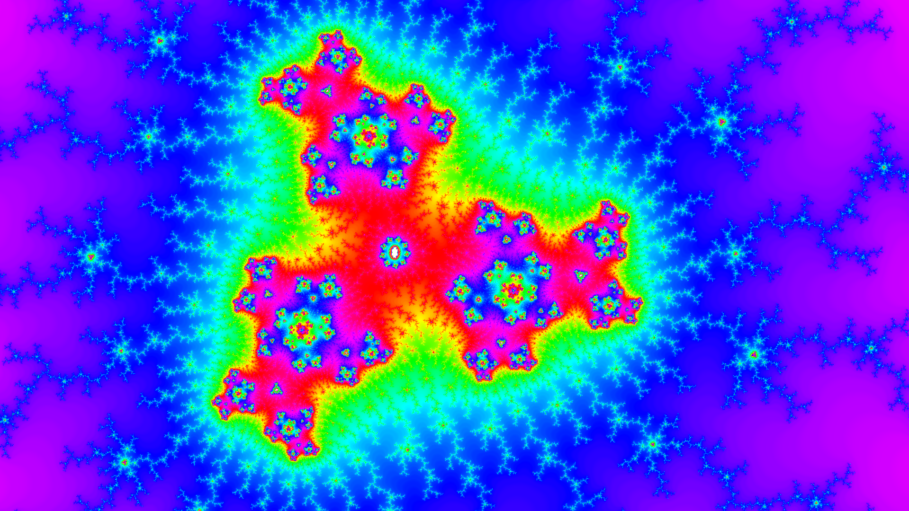

# Apfelmännchen

Das Apfelmännchen, auch bekannt als Mandelbrot-Menge.
Ich finde es wunderschön. Hier ist meine Implementierung 
in Kotlin und Java.

Diesen wunderschöne Farbalgorithmus ist eine Eigenentwicklung ^^ 

Man kann mit dem Mausrad zoomen, verschieben
und Screenshots erstellen.

Es berechnet auf mehreren Threads und braucht ca.
1s pro Bild.

Außerdem kann man statt dem üblichen `z²+c` Algorithmus
auch mit `z³+c` rechnen lassen.

Für eine Apfelmännchen-Version, die wesentlich schneller rendert durch GPU-Unterstützung, 
siehe ein Rust-Projekt von mir, [mandelbrot-gpu-glium](https://github.com/Julian-Wollersberger/mandelbrot-gpu-glium)
